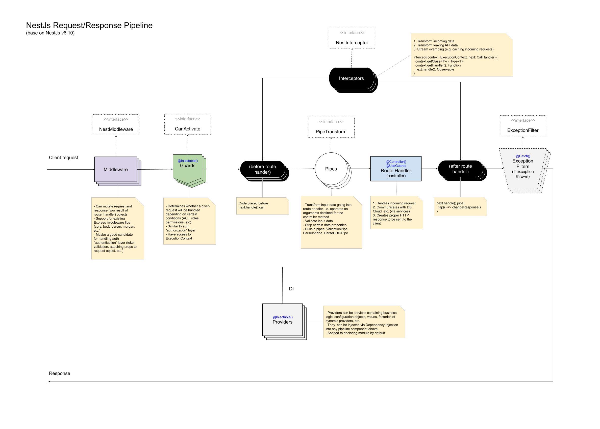

# NestJS - messenger project

NestJS là một framework được sử dụng để xây dựng các ứng dụng phía máy chủ, sử dụng JavaScript và hỗ trợ TypeScript.
Được xây dựng trên nền là framework Express, NestJS kế thừa các tính năng của Express và mở rộng hơn để giúp xây dựng các ứng dụng
dễ mở rộng, bảo trì. NestJS sử dụng Dependency Injection để quản lý khởi tạo vào chia sẻ các thành phần.
NestJS sử dụng kiến trúc module, các module giúp project được tổ chức gọn gàng. Kiến trúc module phân tách ứng dụng thành các khối
chức năng. Các thành phần như controller, provider (service) được đóng gói lại vào module giúp kiểm soát được độ phức tạp của project.
Controller nhận HTTP request, xử lý chúng và trả về respone
Provider là các class chứa logic nghiệp vụ, giao tiếp với DB, có thể được Inject vào trong controller, module và các service khác

- Middleware là function được trước route handler, có thể truy cập đến Request và Respone. Tương tự như trong Express, middleware có thể thực hiện các task: thực hiện một đoạn code bất kì, thay đổi request và respone, trả về respone, gọi đến handler hoặc middleware tiếp theo
- Guard có nhiệm vụ quyết định xem request gửi đến có được thực hiện bởi route handler không (authentication và authorization), guard có thể truy cập tới ExecutionContext
- Interceptor có thể truy cập tới luồng dữ liệu Obserable trong quá trình handler xử lý request. Interceptor có thể gán thêm logic vào trước vào sau route handler, biến đổi kết quả trả về (ví dụ null -> []), truy vấn trong cache thay vì truy vấn DB để tăng tốc độ xử lý request, loggin, set headers
- Pipe có nhiệm vụ validate và transform data. Được thực hiện ngay trước route handler
- Exception filter tiếp nhận exception được thrown trong quá trình xử lý request và trả về respone tuỳ chỉnh theo yêu cầu sao cho user-friendly

Project Messenger
